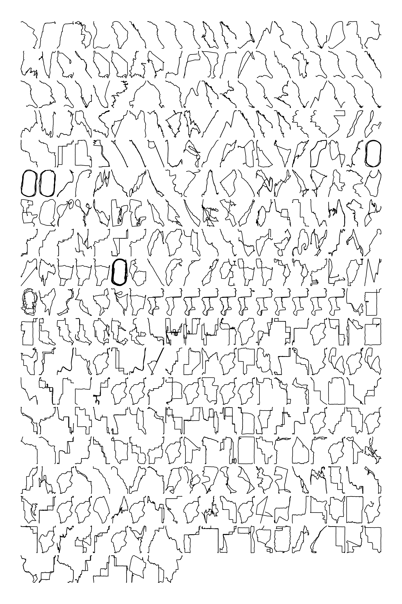
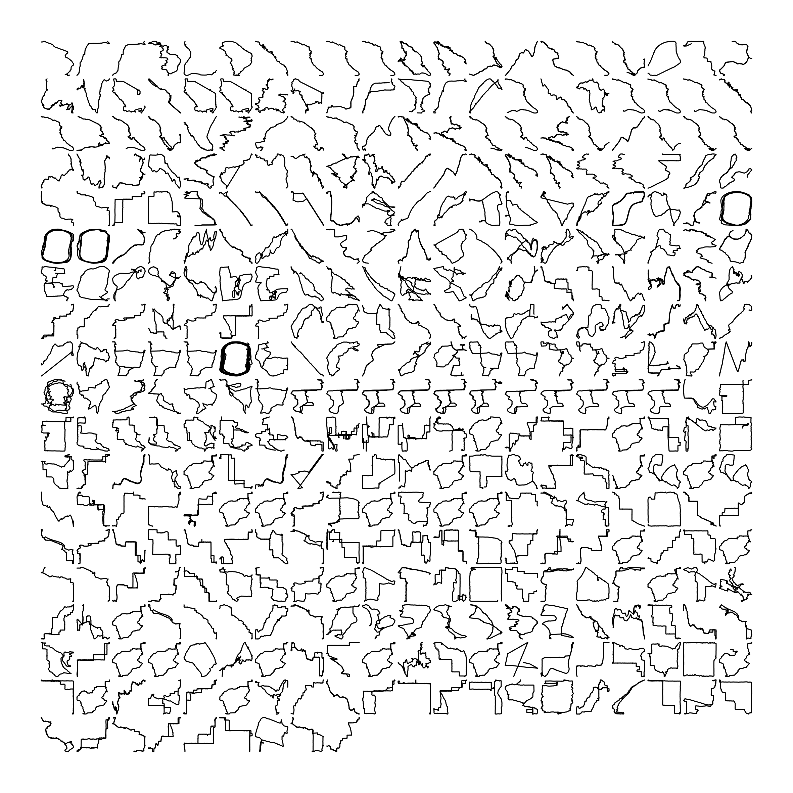
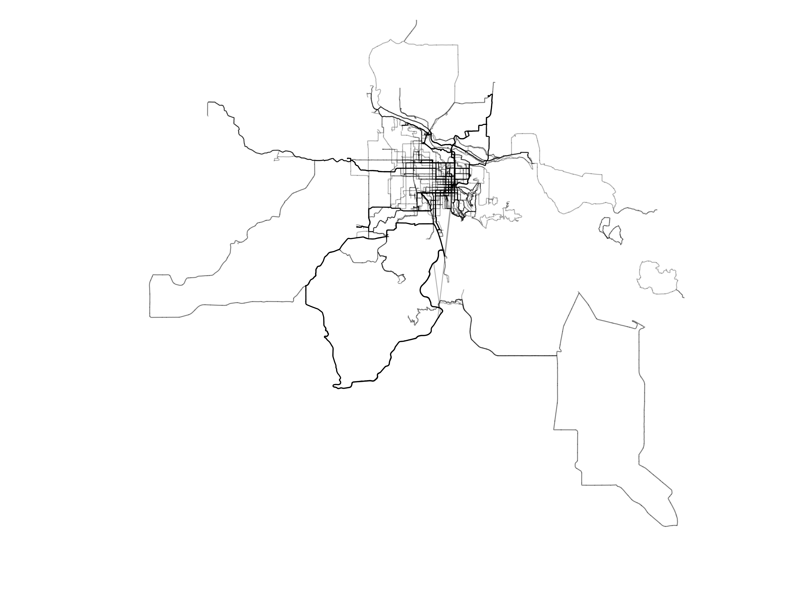
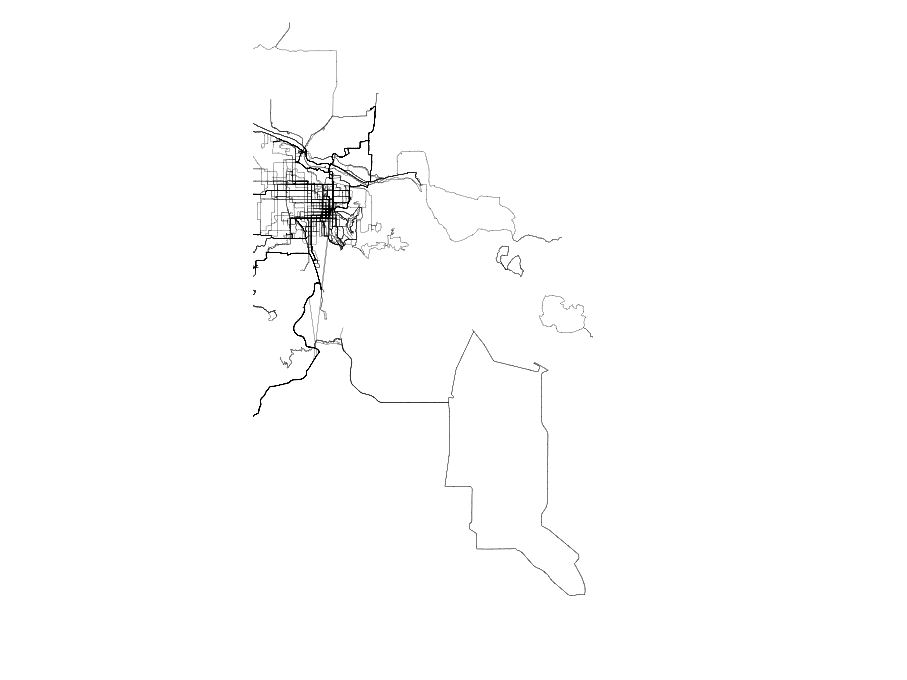

```{r setup, include=FALSE}
library(flexdashboard)
library(tidyverse)
library(dplyr)
library(readr)
library(janitor)
library(lubridate)
library(reactable)
library(strava)
library(here)
library(RColorBrewer)
```


```{r importing desired data fields}
library(readr)
activities <- read_csv("data/activities.csv", 
    col_types = cols_only(`Activity ID` = col_number(), 
                          `Activity Date` =col_character(),
                          `Activity Name` =col_character(),
                          `Activity Type` =col_character(),
                          `Elapsed Time` =col_number(),
                          `Distance` =col_number(),
                          `Elevation Gain` =col_number()))
View(activities)
```

```{r tidying data}
activities[63, 6] =0.91
activities[63, 7] =0.000000
#Activity 63 was my only swim, and entered data in yards. I converted to the needed KM for consistency. There is probably a smarter way to do this.
activities <- activities %>%
        clean_names()
```

```{r cleaning up the time format}
  activities$activity_date <- mdy_hms(activities$activity_date)
```

```{r bringing in the gpx data, then deleting some problematic rows of bad data}
gpxdata <- process_data("data/activities_gpx")
gpxdata <- slice(gpxdata, -c(63744, 63745, 63746))
```

```{r separation of date and time}
activities_tight <- activities %>% 
  mutate_if(is.numeric, round, digits = 2) %>% 
  separate(activity_date, c("Date", "Time"), sep = " ")
activities_tight <- activities_tight[-c(1)]

```


```{r less than 1% of my activies are swimming or e-bike rides, so I removed those}
activities2 <- activities_tight
 activities2 <- slice(activities2, -c(63, 298, 300))

```

```{r splitting date and time made the date info go crazy in my visualization}
activities3 <- activities
 activities3 <- slice(activities3, -c(63, 298, 300))

```

Data Source {.sidebar}
==========
**Data Source**

[Joe Swinehart](https://github.com/JoeSwinehart) created the plots on this page using the [strava](https://github.com/marcusvolz/strava) package.

These visualizations utilize data from  my own Strava logged activities from 2016-2021. Strava activities can be downloaded by the user, [following a bit of guidance](https://support.strava.com/hc/en-us/articles/216918437-Exporting-your-Data-and-Bulk-Export) from Strava. 


Distance and frequency over time
===================================== 

Column {data-width=750}
-----------------------------------------------------------------------


```{r}
ggplot(activities3, aes(activity_date, distance, color = activity_type)) +
  geom_col(key_glyph = "timeseries")+
  labs(title = "My Strava Logged Activities",
       subtitle = "2016-2021",
       y = "Distance (km)",
       x = "Date",
       caption = "I like to pedal.",
      color = "Activity Type")+ 
  scale_color_brewer(palette = "Set2")+
  theme_minimal()
```


Column {.tabset data-width=300}
-----------------------------------------------------------------------

### About

This initial visualization was about the most basic thing I could do with my data. 
I simply graphed each activity over time to see where I was stacking up the kilometers, and if my activities were getting more frequent...or at least my logging of activities.
The first one was a little cluttered, as I had two activity types that had very few entries, but crowded my key unnecessarily. The updated version had a classier looking key (Thanks, David!) and a friendlier color palette.

### Version 1


```{r}
ggplot(activities, aes(activity_date, distance)) +
  geom_col(aes(color = activity_type))+
  labs(title = "My Strava Logged Activities",
       subtitle = "2016-2021",
       y = "Distance (km)",
       x = "Date",
       caption = "I like to pedal.")+    
  theme_minimal()
```


Searchable Table
=====================================     


Column {data-width=750}
-----------------------------------------------------------------------

### A searchable table of my activities

```{r}
activities2 %>% 
  reactable(
    searchable = TRUE,
    filterable = TRUE,
    columns = list(
      Date = colDef(name = "Date"),
      Time = colDef(name = "Time"),
      activity_name = colDef(name = "Activity Name"),
      activity_type = colDef(name = "Activity Type"),
      elapsed_time = colDef(name = "Elapsed Time"),
      distance = colDef(name = "Distance (km)"),
      elevation_gain = colDef(name = "Elevation Gain (m)")
    )
  )
```


Column {.tabset data-width=300}
-----------------------------------------------------------------------

### About

This table used the skills we learned in class...it was a pretty nice fit for this dataset, and I can search for particular activities pretty easily. Kind of fun. The first version was a little messier, with date and time smashed together, and a fairly useles Activity ID field...but the peer review process cleaned it up a bit.

### Version 1


```{r}
activities %>% 
  reactable(
    searchable = TRUE,
    filterable = TRUE,
    columns = list(
      activity_id = colDef(name = "Activity ID"),
      activity_date = colDef(name = "Activity Date"),
      activity_name = colDef(name = "Activity Name"),
      activity_type = colDef(name = "Activity Type"),
      elapsed_time = colDef(name = "Elapsed Time"),
      distance = colDef(name = "Distance (km)"),
      elevation_gain = colDef(name = "Elevation Gain (m)")
    )
  )
```


View from above
=====================================     


Column {data-width=750}
-----------------------------------------------------------------------


### A view of my activities from above

```{r picture, echo = F, fig.cap = "Bird's-eye views", out.width = '100%'}

```


Column {.tabset data-width=300}
-----------------------------------------------------------------------

### About

I totally like this visualization of all of my activities, but I could tell that the initial run-through was a little off. Turns out that forcing my image into a square meant that everything was not projecting as it ought to.

### Version 1
```{r picture2, echo = F, fig.cap = "My Activities", out.width = '100%'}

```


Local fun
=====================================     


Column {data-width=750}
-----------------------------------------------------------------------


### What have I done in Lane County?

```{r picture3, echo = F, fig.cap = "From Bear Creek to Gimpl and a few things in between", out.width = '100%'}

```


Column {.tabset data-width=300}
-----------------------------------------------------------------------

### About

I totally like this visualization of all of my local activities, but on the first go-round I had the lat and long boundaries off a little, so I needed to improve that for the final.

### Version 1
```{r picture4, echo = F, fig.cap = "Eugene rides", out.width = '100%'}

```


A Calendar
=====================================  

Column {data-width=750}
-----------------------------------------------------------------------


### Exercise is more frequent, or at least I am tracking it more regularly...
```{r, fig.width=20, fig.height=20}
plot_calendar(gpxdata, unit = "distance") +
  labs(title = "My Exercise Across the Years") 

```


Column {.tabset data-width=300}
-----------------------------------------------------------------------

### About

This visualization came out of the strava package I used. I like it, but I think it could be better with some improvement to the color scheme. Guess that will be my next R project....diving under the hood of other people's code!

### Version 1


```{r, fig.width=20, fig.height=20}
plot_calendar(gpxdata, unit = "distance") +
  labs(title = "My Exercise Across the Years") 

```


```{r birds-eye views}
p1 <- plot_facets(gpxdata)
ggsave("plots/facet001.png", p1, width = 20, height = 20, units = "cm")
```


```{r when do I exercise?}
#it is beyond my current skill set to alter all activities to fit into my current time zone. I am pretty sure it could be done, but not by me...yet. I know my activities overseas are producing some weird spikes, as I know that 3am on Wednesday is not actually a time I exercise. Ever.

p5 <- plot_ridges(gpxdata)
ggsave("plots/ridges001.png", p5, width = 20, height = 30, units = "cm")
```

```{r am I getting more active?}
p4 <- plot_calendar(gpxdata, unit = "distance")
ggsave("plots/calendar001.png", p4, width = 20, height = 20, units = "cm")
```

```{r eugene routes}
p2 <- plot_map(gpxdata, lon_min = -122.92, lon_max = -123.1, lat_min = 43.88, lat_max = 44.1)
ggsave("plots/map001.png", p2, width = 20, height = 15, units = "cm", dpi = 600)
```

```{r eugene routes improved}
p2 <- plot_map(gpxdata, lon_min = -122.9, lon_max = -123.3, lat_min = 43.88, lat_max = 44.1)
ggsave("plots/map002.png", p2, width = 20, height = 15, units = "cm", dpi = 600)
```


```{r birds-eye views improved...less distortion by adding height to the image}
p1 <- plot_facets(gpxdata)
ggsave("plots/facet002.png", p1, width = 20, height = 30, units = "cm")
```

